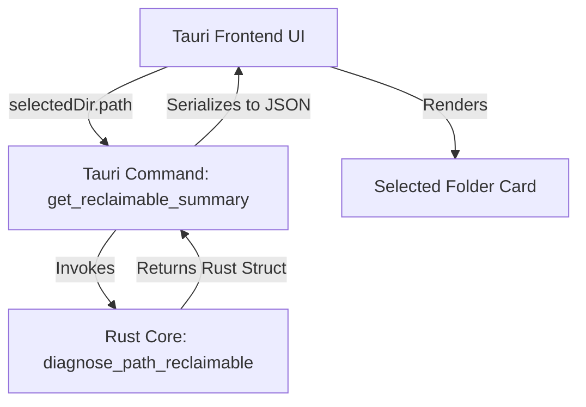

# UI Reclaimable Estimate Design Plan

Status: N-2 design only. No implementation changes, Rust modifications, Tauri commands, or UI source edits are included.

## 1. Problem Statement

The core purpose of disk-insight is to assist users in making informed decisions about how to free up disk space. 

With the completion of N-1b, the diagnostic CLI now reports a path-specific `Reclaimable estimate` via `--diag-path`. This includes a primary recovery estimate, confidence rating, and safety cautions. However, during daily interactive use, this valuable cleanup information is invisible because the Tauri desktop UI only shows raw size estimates.

To bridge the gap between diagnostic evidence and everyday usability, the UI must show "how much space is likely to be reclaimed if this folder is removed or relocated" whenever a folder is selected.

### Important Constraint
disk-insight is an analysis-only utility. It **does not** provide a deletion feature, and this design must not suggest or facilitate unsafe manual deletions.

---

## 2. Display Position Comparison

We evaluated three options for displaying this information in the desktop UI:

| Option | Description | Pros | Cons | Verdict |
|--------|-------------|------|------|---------|
| **A. Selected Folder Card** | Show the full estimate details (Reclaimable size, confidence badge, basis, and caution text) directly inside the existing folder detail card. | High visibility; fits detailed warnings; minimum UI clutter. | Limited to the currently selected folder. | **Recommended** |
| **B. Direct Children Rows** | Add an "Est. Reclaimable" column or mini-badges next to each directory row in the right-pane list. | Allows at-a-glance comparisons of subfolders before clicking. | Extreme UI noise; requires running complex logic for every child; high performance cost. | **Deferred** |
| **C. TreeView Nodes** | Add confidence/reclaimable mini-badges directly into the left-pane directory tree. | High contextual utility during navigation. | Limited horizontal space; severe performance risks on large expansions. | **Deferred** |

### Verdict
We recommend a combination of **C and A (focused on A first)**:
- **Phase N-2b (Minimal implementation)**: Add the `Estimated reclaimable` section strictly inside the **Selected Folder Card** on the right.
- **Subsequent Phases**: Defer child-level estimations until the folder-level display has been verified.

---

## 3. UI Display Elements

The selected folder card should display the following elements under a clear heading:

1. **Estimated Reclaimable**: The primary estimated size (usually matches the WOF-adjusted size, or shows a warning label for system folders).
2. **Reference Range**: The possible recovery range (from `wof_adjusted` to `current` size).
3. **Confidence Badge**: A visual rating of the estimate's reliability.
4. **Basis**: A short technical reason explaining how the estimate was computed.
5. **Caution**: Critical safety advice or recommended cleanup methods.

### Path-Specific Scenarios

#### Scenario 1: Ordinary User Data (e.g., `C:\Users`)
* **Estimated Reclaimable**: `85.4 GB`
* **Reference Range**: `85.4 GB - 85.7 GB`
* **Confidence**: `High` (Green)
* **Basis**: `Current and WOF-adjusted estimates are close.`
* **Caution**: `Review files carefully. Do not blindly delete a user profile directory.`

#### Scenario 2: Application Subtrees (e.g., `C:\Program Files`)
* **Estimated Reclaimable**: `24.8 GB`
* **Reference Range**: `24.8 GB - 29.7 GB`
* **Confidence**: `Medium` (Amber)
* **Basis**: `WOF-adjusted estimate. WOF delta mainly from WindowsApps.`
* **Caution**: `Use the Windows Apps & Features settings or official uninstallers. Do not manually delete application folders.`

#### Scenario 3: Windows System Folders (e.g., `C:\Windows`)
* **Estimated Reclaimable**: `Not recommended` (Red/Muted text)
* **Reference Range**: `18.0 GB - 26.7 GB`
* **Confidence**: `Low` (Red or Muted Gray)
* **Basis**: `Windows special accounting / hardlinks / component store.`
* **Caution**: `Use standard Windows Disk Cleanup tools (cleanmgr / DISM). Manual deletion of Windows system directories will corrupt the OS.`

---

## 4. Confidence Badge Visuals

The confidence rating must use distinct colors and text to ensure accessibility:

- **High Confidence**: Green text and light-green background. Symbolizes high certainty (e.g., ordinary files/downloads).
- **Medium Confidence**: Amber/Orange text and light-yellow background. Indicates typical application folders where uninstallation is safer than deletion.
- **Low Confidence / Not Recommended**: Red or dark-gray text with light-red or light-gray background. Warns against manual deletion of system/OS folders.

*Note: Visual states must rely on both text labels and color coding, ensuring clarity under all themes.*

---

## 5. UI Wording Guidelines

To avoid misleading users into unsafe operations, the UI copy must strictly follow these vocabulary rules:

| Avoid (Do NOT use) | Prefer (DO use) | Rationale |
|--------------------|-----------------|-----------|
| `will reclaim` | `Estimated reclaimable` | Prevents exact free-space promises. |
| `guaranteed` | `Likely` | Reflects NTFS allocation uncertainties. |
| `safe to delete` | `Confidence: High/Medium/Low` | Avoids endorsing manual directory wipes. |
| `delete this` / `delete` | `Caution: Use app uninstall` | Guides users toward supported OS mechanisms. |
| `0 bytes` (for Windows) | `Not recommended as deletion target` | Prevents users from thinking a system folder takes no space. |

---

## 6. Implementation Architecture Plan (N-2b)

For the future N-2b minimal implementation, we propose the following data architecture:



### Key Decisions
1. **Rust-Centric Logic**: Keep the classification rules and text generation strictly on the Rust side (`src/mft_probe.rs`). The UI frontend should remain thin and only focus on layout and styling. This guarantees that the CLI (`--diag-path`) and the UI show identical, correct values.
2. **Dedicated Tauri Command**: Introduce a new Tauri command:
   ```rust
   #[tauri::command]
   async fn get_reclaimable_summary(path: String) -> Result<ReclaimableSummary, String>
   ```
   This command will run in a lightweight `spawn_blocking` pool to query the in-memory cache without blocking the main thread.
3. **JSON Schema Separation**: Keep this summary entirely separate from the main `--json` scan tree output to avoid ballooning the initial payload size.

---

## 7. Must Not Do (Out of Scope)

The following items are strictly out of scope for this design and any near-term implementation:

- **No Delete Action**: The app must not provide any delete button or file-moving actions.
- **No Safe-to-Delete Claims**: Never mark a path as "safe to delete manually."
- **No Exact Parity Claims**: Do not promise byte-exact matches with Windows Explorer "Properties" or other tools.
- **No Hardlink/WinSxS Corrections**: Retain these as documented known limitations rather than attempting production-level deduplication.

---

## 8. Next Steps and Roadmap

We recommend the following incremental roadmap:

1. **N-2b: Selected Folder Reclaimable Display (Next step)**
   - Implement the `get_reclaimable_summary` Tauri command.
   - Update the UI frontend `SelectedFolderCard` to invoke this command when a folder is selected.
   - Render the estimated reclaimable size, confidence badge, basis, and caution text.
2. **N-2c: UI "Explain size" Detail Button**
   - Add an interactive link or button next to the caution text that opens a modal showing the deeper M-3c evidence (e.g., top WOF files or hardlink suspect count).
3. **N-2d: Real-Device Evaluation**
   - Conduct a structured evaluation using `docs/daily-use-retry-checklist.md` to see if the UI reclaimable indicators effectively guide cleanup decisions and resolve the daily-use size-trust issues.
